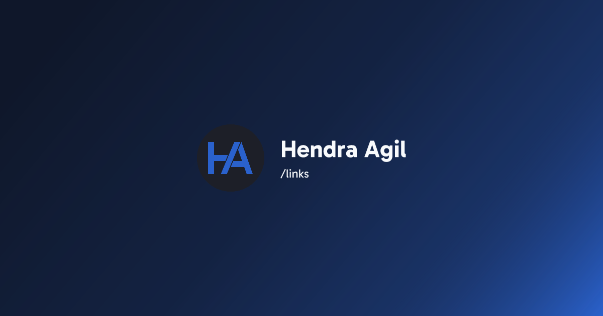

# links

[](https://hendraaagil.dev/links)

## Developing

Node.js `>= 16.x` setup with [yarn](https://yarnpkg.com/) is recommended.

```bash
# duplicate & fill environment file
cp .env.example .env.local

# install dependencies
yarn

# serve with hot reload at localhost:3000
yarn dev

# build for production
yarn build
```

## Make your own links

You can make your own links by clone this project and change some configuration and styling.

Change your:

- Title and description in [here](vite.config.ts#L16-L21).

- Font in [here](tailwind.config.cjs#L5-L7) and change the import in [main.tsx](src/main.tsx#L5-L12) file.

  This project is using [fontsource](https://fontsource.org/), follow the docs if you get stuck.

- Color theme in [here](tailwind.config.cjs#L10-L14).

- List of links in [here](src/data/links.ts).

  The icon is using [react-icons](https://react-icons.github.io/react-icons/), find your favorite icons in there.

- Image assets:

  - Favicon: [ico](public/favicon.ico) and [svg](public/icon.svg) file.
  - [Open graph image](public/og-image.png), recommended resolution is 1200 x 630.
  - [Logo image](src/assets/ha-logo.svg), for logo displayed in the page.

## License

This source code is under [MIT License](LICENSE)
